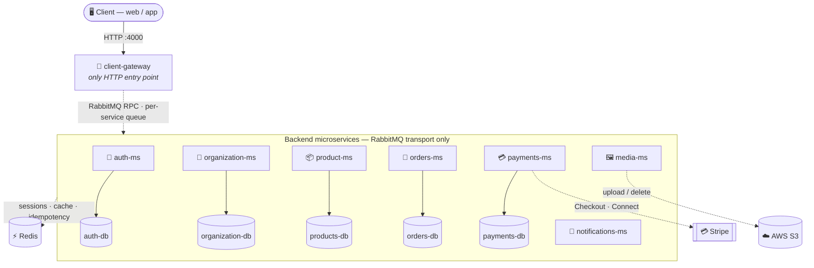
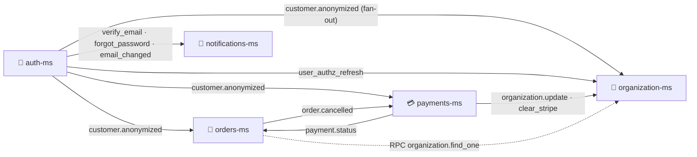

<h1 align="center">🚀 Commerce App Launcher</h1>

<p align="center">
  <b>Microservices-based commerce / restaurant-POS platform.</b><br/>
  Orchestration layer holding the root <code>docker-compose.yml</code>, shared config, an observability stack,<br/>
  and each backend service as a Git submodule. <i>It contains no application code of its own.</i>
</p>

<p align="center">
  
  
  
  
  
  
</p>

<p align="center">
  
  
  
  
  
  
  
</p>

<br/>

All eight services are **NestJS** applications written in **TypeScript**, communicating over **RabbitMQ** (RPC request/response and topic-exchange events). **PostgreSQL** (via TypeORM) and **Redis** are shared infrastructure; several services also integrate with **Stripe** and **AWS S3**.

> [!IMPORTANT]
> This README, and the per-service READMEs it links to, document **only what was verified directly in the source code** of this repository as of **2026-07-16**. Anything the audit could not confirm is marked **`TODO: verify`** — including in the linked service READMEs. Do not treat unmarked statements below as more certain than the underlying service README.

<br/>

## 📦 Services

| Service | Directory | Role | Real port | Public HTTP API |
|---|---|---|---|:---:|
| 🚪 **Client Gateway** | [`client-gateway/`](client-gateway/README.md) | Single HTTP entry point for clients (SaaS dashboard + storefront); auths requests, proxies to backend services over RabbitMQ, terminates Stripe webhooks | `4000` | ✅ |
| 🔐 **Auth MS** | [`auth-ms/`](auth-ms/README.md) | Authentication / session / profile management for SaaS staff and organization customers (JWT, Redis sessions, Google OAuth) | `4002` (RMQ) | ❌ |
| 📦 **Product MS** | [`product-ms/`](product-ms/README.md) | Product catalog: products, categories, tags, ingredients, extras | `4001` (RMQ) · `9100` metrics | ❌ |
| 🏢 **Organization MS** | [`organization-ms/`](organization-ms/README.md) | Organizations, domains, user↔organization memberships / roles | `4003` (RMQ) | ❌ |
| 🧾 **Orders MS** | [`orders-ms/`](orders-ms/README.md) | Orders (dine-in / POS / scheduled), items, tables, sectors, cash sessions, sales analytics | `4007` (RMQ) | ❌ |
| 💳 **Payments MS** | [`payments-ms/`](payments-ms/README.md) | Payments, payment methods, subscriptions, Stripe (Checkout, Subscriptions, Connect Express) | `4006` (RMQ) | ❌ |
| 🖼️ **Media MS** | [`media-ms/`](media-ms/README.md) | File upload / delete backed by AWS S3 | none bound | ❌ |
| 📧 **Notifications MS** | [`notifications-ms/`](notifications-ms/README.md) | Consumes events and sends transactional email (password reset, verification, email-changed) via SMTP + Handlebars | none bound | ❌ |

> [!NOTE]
> **Verified across multiple services:** every backend microservice (everything except `client-gateway`) is bootstrapped with `NestFactory.createMicroservice(..., { transport: Transport.RMQ })` and does **not** call `app.listen(port)` for HTTP. The `PORT` env var is used only in a startup log line in most of them. The "real port" numbers above are what `docker-compose.yml`, each Dockerfile, and `.env.example` agree on for container mapping — they do **not** necessarily correspond to an actual listening TCP port. Several services have inconsistent `EXPOSE`/`.env.example`/compose port values (see each README). **`client-gateway` is the only service confirmed to open a real HTTP listener**, and all inter-service communication happens exclusively over RabbitMQ — no direct HTTP or gRPC calls between services were found.

<br/>

## 🏗️ Architecture

### Request path — synchronous (RabbitMQ RPC)



> `media-ms` and `notifications-ms` have **no database**. `notifications-ms` also has no outbound queue of its own (pure consumer).

### Event flows — asynchronous (topic exchange `app.events`)

Cross-service events **actually found in the code** (not inferred). Solid arrows = topic-exchange events; dashed = an RPC request/response call.



<details>
<summary><b>📖 Event flow details (click to expand)</b></summary>

<br/>

- **auth-ms → notifications-ms** — `verify_email.saas`, `verify_email.customer`, `forgot_password.saas`, `forgot_password.customer`, `saas_mailer_email_changed`, `customer_mailer_email_changed` — consumed and rendered as transactional emails.
- **auth-ms → orders-ms, payments-ms, organization-ms** — `customer.anonymized` (fan-out to all three) — each service nulls/soft-deletes the customer's PII/records.
- **auth-ms → organization-ms** — `userOrganization.user_authz_refresh` — rebuilds a Redis-cached list of a user's organizations/roles.
- **orders-ms → payments-ms** — `order.cancelled` — cancels active payments for the order.
- **payments-ms → orders-ms** — `payment.status` — orders-ms updates order state on payment success/failure.
- **payments-ms → organization-ms** — `organization.update_event`, `organization.clear_stripe_account` / `organization.stripe.clear` — clears a Stripe Connect account reference.
- **orders-ms → organization-ms** — RPC `organization.find_one` (request/response) — reads scheduling config (`orderSchedulingIntervalMinutes`, `maxDishesPerSlot`, `openingHours`) when validating scheduled orders.
- **client-gateway → all backend services** — RPC over each dedicated queue (`auth_queue`, `organization_queue`, `products_queue`, `orders_queue`, `payments_queue`, `media_queue`) for every proxied HTTP request. Plus dedicated outbound clients for two event-only queues (`RMQ_EVENTS_QUEUE_ORGANIZATION`, `RABBITMQ_QUEUE_EVENTS_PAYMENTS`).

</details>

> [!CAUTION]
> **Stripe webhooks — `TODO: verify`.** `payments-ms` has no HTTP endpoint and no Stripe signature-verification code; it receives webhook data as a RabbitMQ event (`payment.webhook`). `client-gateway` does expose `POST /webhooks/platform` and `POST /webhooks/connect` with real Stripe signature verification, but the audit could not confirm end-to-end that the gateway is what republishes the verified event onto `payment.webhook`. Plausible but unverified.

<br/>

## 🧰 Stack

Verified per-service from each `package.json`:

| Layer | Technology |
|---|---|
| **Language** | TypeScript 5.7 |
| **Framework** | NestJS 11 (`@nestjs/core`, `@nestjs/common`, `@nestjs/microservices`) |
| **Database** | PostgreSQL 16.2 via TypeORM 0.3 — one DB per service¹ |
| **Messaging** | RabbitMQ (`rabbitmq:3-management`) via `Transport.RMQ`, `amqplib`, `amqp-connection-manager` |
| **Cache / sessions** | Redis 7 via `ioredis` |
| **Env validation** | `zod` in every service (`src/config/envs.ts`) — throws at startup on missing vars |
| **Payments** | `stripe` SDK (client-gateway & payments-ms) |
| **File storage** | `@aws-sdk/client-s3` (media-ms) |
| **Email** | `@nestjs-modules/mailer` + `nodemailer` + `handlebars` (notifications-ms) |
| **Runtime** | Node 20 (Alpine) in every Dockerfile |
| **Observability** | Prometheus `v2.53.0`, Grafana `11.1.0`, `redis_exporter`² |

<sub>¹ auth-ms, product-ms, organization-ms, orders-ms and payments-ms each have their own DB; media-ms and notifications-ms have none.</sub><br/>
<sub>² Of the application services, only `product-ms` has real code-level Prometheus instrumentation (`prom-client`, `/metrics` on port 9100).</sub>

<br/>

## ▶️ Running the Full Stack

**Prerequisites:** Docker & Docker Compose (v2), Git with submodule support, and Node.js 20+ (only for running a service outside Docker).

```bash
git clone <repository-url>
cd commerce-app-launcher
git submodule update --init --recursive

cp .env.example .env
# then fill in real secrets — see "Environment Variables" below

docker compose up --build
```

This brings up: `redis`, `rabbitmq`, `client-gateway`, each `*-ms` + its `*-db`, plus the observability stack (`prometheus`, `redis-exporter`, `grafana`). Each application service runs `npm run start:dev` with its directory bind-mounted for live reload.

<details>
<summary><b>🔌 Port mappings (from <code>docker-compose.yml</code>)</b></summary>

<br/>

| Service | Host port |
|---|---|
| client-gateway | `4000` |
| products-ms | `4001` (+ metrics `9100`, `127.0.0.1` only) |
| auth-ms | `4002` |
| organization-ms | `4003` |
| media-ms | `4004` |
| notifications-ms | `4005` |
| payments-ms | `4006` |
| orders-ms | `4007` |
| RabbitMQ AMQP | `5672` |
| RabbitMQ management UI | `15672` |
| Redis | `6379` (`127.0.0.1` only) |
| products-db | `5432` (`127.0.0.1` only) |
| auth-db | `5433` |
| organization-db | `5434` |
| payments-db | `5435` |
| orders-db | `5436` |
| Prometheus UI | `9090` (`127.0.0.1` only) |
| Grafana UI | `3001` (`127.0.0.1` only) → container `3000` |

Most "service" ports (`4001`–`4007`, excluding `4000`) are container-port mappings that do **not** correspond to a bound HTTP port — the services are RabbitMQ-only. Treat them as informational/reserved unless a service's README says otherwise.

</details>

<details>
<summary><b>🧩 Running a single service outside Docker</b></summary>

<br/>

```bash
docker compose up redis rabbitmq auth-db   # infra only, example for auth-ms
cd auth-ms
npm install
cp .env.example .env   # auth-ms's own .env.example is missing several required vars — see auth-ms/README.md
npm run start:dev
```

Repeat with the relevant `*-db` service(s) for other backend services.

</details>

<details>
<summary><b>🧹 Stopping / cleaning up</b></summary>

<br/>

```bash
docker compose down          # stop and remove containers
docker compose down -v       # also remove named volumes (deletes DB / Redis / Prometheus / Grafana data)
```

</details>

<br/>

## 🔑 Environment Variables

The root `.env.example` lists the variables `docker-compose.yml` substitutes into each service's container. **It is not exhaustive** — the audits found required variables (per each service's Zod schema) missing from both the root and per-service example files. Each service's README documents its full, verified list and flags the missing keys.

> [!WARNING]
> Do **not** assume the root `.env.example` alone is enough to boot every service. Known gaps in the root example include:
> - `REDIS_PASS` — **missing** (required by multiple services)
> - `JWT_SECRET_VERIFY_EMAIL` — **missing** (required by auth-ms)
> - `STRIPE_PRICE_ID_BASIC` / `STRIPE_PRICE_ID_PRO` — **missing** (required by payments-ms)
> - `LOGO_URL`, `APP_NAME`, `APP_URL` — **missing** (required by notifications-ms)

<details>
<summary><b>📋 Root <code>.env.example</code> groups</b></summary>

<br/>

`NODE_ENV` · RabbitMQ (`RABBITMQ_USER`/`PASS`/`HOST`/`PORT`/`URL`) · Redis (`REDIS_HOST`/`PORT`) · frontend URL (`CLIENT_URL`) · JWT secrets (`JWT_SECRET_ACCESS`/`REFRESH`/`RESET`) · Stripe (`STRIPE_SECRET`, `STRIPE_WEBHOOK_SECRET`, `STRIPE_CONNECT_WEBHOOK_SECRET`) · Google OAuth (`GOOGLE_CLIENT_ID`) · SMTP (`SMTP_HOST`/`PORT`/`USER`/`PASS`/`FROM`) · AWS (`AWS_ACCESS_KEY_ID`/`SECRET_ACCESS_KEY`/`REGION`/`BUCKET`) · database credentials and per-service DB names · per-service RabbitMQ queue name variables.

</details>

<br/>

## 🗂️ Repository Structure

```
commerce-app-launcher/
├── docker-compose.yml       # Orchestrates all services + infra + observability
├── .env.example             # Template for shared/root env variables (incomplete — see above)
├── .gitmodules              # Each service below is a separate Git submodule
├── observability/           # Prometheus + Grafana provisioning config
├── client-gateway/          # HTTP API gateway
├── auth-ms/                 # Authentication / session service
├── product-ms/              # Product catalog service
├── organization-ms/         # Organization / membership service
├── orders-ms/               # Orders / POS service
├── payments-ms/             # Payments / subscriptions / Stripe service
├── media-ms/                # S3 file storage service
└── notifications-ms/        # Transactional email service
```

Each service directory is a Git submodule (see `.gitmodules`) tracking its own repository on the `develop` branch.

<br/>

## 📚 Per-Service Documentation

| Service | What its README covers |
|---|---|
| [🚪 Client Gateway](client-gateway/README.md) | HTTP routes, guards, downstream RabbitMQ queue map, Stripe webhook handling |
| [🔐 Auth MS](auth-ms/README.md) | All RabbitMQ message patterns, JWT/session model, outbound events |
| [📦 Product MS](product-ms/README.md) | Catalog message patterns, data model, Prometheus metrics |
| [🏢 Organization MS](organization-ms/README.md) | Organization/membership patterns, Redis cache scheme |
| [🧾 Orders MS](orders-ms/README.md) | Order/table/sector/cash-session patterns, inter-service calls |
| [💳 Payments MS](payments-ms/README.md) | Payment/subscription/Connect patterns, implemented Stripe features |
| [🖼️ Media MS](media-ms/README.md) | S3 upload/delete message patterns |
| [📧 Notifications MS](notifications-ms/README.md) | Consumed email events and templates |

<br/>

## 🧭 Known Gaps Across the Platform

> [!NOTE]
> These are tracked openly on purpose — the README's job is to reflect the code as it actually is, not as it should be.

- 🧪 **No test files** in auth-ms, organization-ms, orders-ms (a few `.spec.ts`), payments-ms (2 spec files), media-ms, notifications-ms and product-ms, despite `test`/`test:e2e` scripts in every `package.json`. `client-gateway` has real, extensive `.spec.ts` coverage, but its `test:e2e` script is broken (no `test/` directory).
- ⚙️ **Every backend `.env.example` is missing ≥1 variable** its own Zod schema requires (commonly `REDIS_PASS`) — copying it as-is fails startup validation in most services.
- 🗃️ **No database migrations anywhere** — every service relies on TypeORM `synchronize: true`; a production migration strategy isn't documented in code.
- 🧟 **Dead code** — several services define RabbitMQ pattern constants / client tokens with no implementation (e.g. unimplemented `find_all`/`restore` in organization-ms and product-ms join-entity controllers; unused `RabbitMQModule`/`RMQ_SERVICE` clients in media-ms and product-ms).
- 🔀 **Port / `.env.example` / Dockerfile inconsistencies** in payments-ms, media-ms and orders-ms. Since none bind a real HTTP port, the impact is documentation confusion only.
- 💸 **Refunds and PayPal are not implemented** in payments-ms despite related enum values / pattern constants (flagged in code as `TODO[CRITICAL][REFUND]`).

<br/>

## ❓ TODO: Verify — platform-level, not confirmed by this audit

- Which service (if any) actually terminates Stripe's real HTTP webhook and republishes it onto `payment.webhook`.
- Whether the real (gitignored) root `.env` supplies every variable each service's Zod schema requires — the audits only checked `.env.example` files and source code.
- Production deployment process / CI — no CI config or deployment scripts were found or reviewed.

<p align="center">
  
</p>
