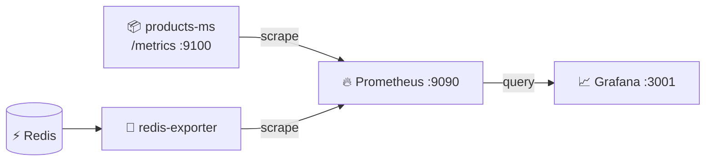

<h1 align="center">📊 Observability · <code>products-ms</code></h1>

<p align="center">
  <b>Prometheus + Grafana + redis_exporter</b> running alongside the existing Docker Compose stack.
</p>

<p align="center">
  
  
  
  
</p>

<br/>

## ✨ What was added

| Component | Image | Purpose |
|---|---|---|
| `prometheus` | `prom/prometheus:v2.53.0` | Scrapes and stores metrics |
| `redis-exporter` | `oliver006/redis_exporter` | Exports Redis server metrics — no code changes to Redis |
| `grafana` | `grafana/grafana:11.1.0` | Dashboard UI |

> [!NOTE]
> All three join the existing `app-network`, so they can resolve other services by name.

<br/>

## 🔭 How it fits together



<br/>

## 🚀 How to start

**1. Rebuild products-ms** (`prom-client` was added to `package.json`):

```bash
docker compose build products-ms
```

**2. Start (or restart) the full stack:**

```bash
docker compose up -d
```

**3. Open the UIs:**

| URL | What you see |
|---|---|
| <http://localhost:3001> | Grafana (login `admin` / `admin` — or `GRAFANA_PASSWORD` from your `.env`) |
| <http://localhost:9090> | Prometheus query explorer |
| <http://localhost:9090/targets> | Scrape health — both targets should be 🟢 green |

**4. Find the dashboard** — in Grafana: **Dashboards → Browse → products-ms → products-ms Observability**.

> [!TIP]
> The dashboard is auto-provisioned from `observability/grafana/dashboards/products-ms.json` and loads within ~30 seconds of Grafana starting.

<br/>

## ⚙️ Optional `.env` variable

```env
GRAFANA_PASSWORD=yourpassword   # defaults to "admin" if not set
```

> `METRICS_PORT` is hardcoded to `9100` in `docker-compose.yml` for products-ms and does **not** need to be in `.env`.

<br/>

## 📈 Dashboard panels

| Panel | What it tells you |
|---|---|
| **Cache Hit Ratio** | Fraction of reads served from Redis; `1.0` = DB never queried |
| **DB Query Duration p50 / p95 / p99** | Latency of DB calls on cache misses |
| **Redis Memory used vs cap** | `used_memory` vs the 256 MB `--maxmemory` limit |
| **Redis Evicted Keys Rate** | Keys/s removed by the volatile-lru policy when Redis is full |
| **products-ms Process RSS** | Node.js physical memory — flat plateau is healthy, steady growth = leak |

<br/>

## ➕ Adding a new microservice

1. Add `prom-client` and a `startMetricsServer` call to the new service (same pattern as products-ms).
2. Add a new `scrape_config` block to `observability/prometheus.yml`.
3. Run `docker compose restart prometheus`.
4. Metrics appear in Prometheus and can be added to the Grafana dashboard immediately.

<p align="center">
  
</p>